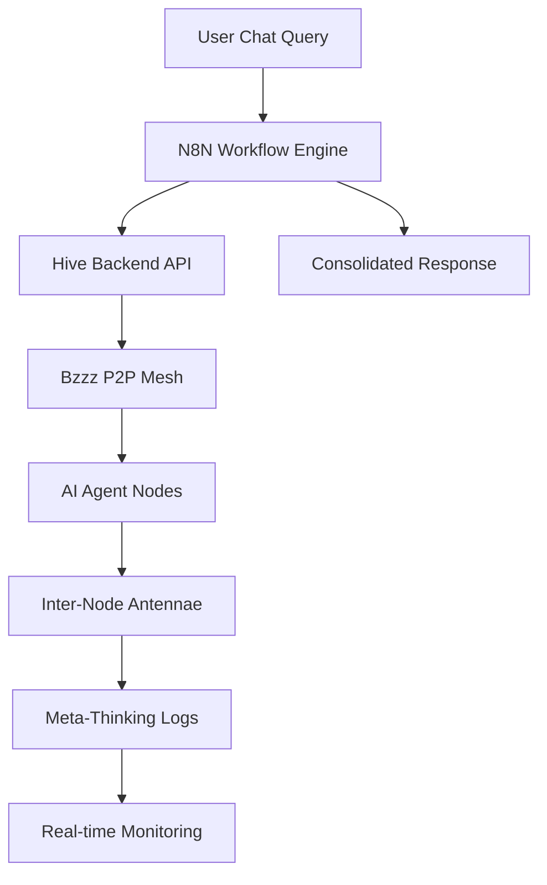

# Bzzz P2P Mesh Chat N8N Workflow Architecture

**Date**: 2025-07-13  
**Author**: Claude Code  
**Purpose**: Design and implement N8N workflow for chatting with bzzz P2P mesh and monitoring antennae meta-thinking

---

## 🎯 Project Overview

This document outlines the architecture for creating an N8N workflow that enables real-time chat interaction with the bzzz P2P mesh network, providing a consolidated response from distributed AI agents and monitoring their meta-cognitive processes.

### **Core Objectives**

1. **Chat Interface**: Enable natural language queries to the bzzz P2P mesh
2. **Consolidated Response**: Aggregate and synthesize responses from multiple bzzz nodes
3. **Meta-Thinking Monitoring**: Track and log inter-node communication via antennae
4. **Real-time Coordination**: Orchestrate distributed AI agent collaboration

---

## 🏗️ Architecture Overview

### **System Components**



### **Current Infrastructure Leveraging**

**✅ Existing Components**:
- **Hive Backend API**: Complete bzzz integration endpoints
- **Agent Network**: 6 specialized AI agents (ACACIA, WALNUT, IRONWOOD, ROSEWOOD, OAK, TULLY)
- **Authentication**: GitHub tokens and N8N API keys configured
- **Database**: PostgreSQL with project and task management
- **Frontend**: Real-time bzzz task monitoring interface

---

## 🔧 N8N Workflow Architecture

### **Workflow 1: Bzzz Chat Orchestrator**

**Purpose**: Main chat interface workflow for user interaction

**Components**:

1. **Webhook Trigger** (`/webhook/bzzz-chat`)
   - Accepts user chat queries
   - Validates authentication
   - Logs conversation start

2. **Query Analysis Node**
   - Parses user intent and requirements
   - Determines optimal agent specializations needed
   - Creates task distribution strategy

3. **Agent Discovery** (`GET /api/bzzz/active-repos`)
   - Fetches available bzzz-enabled nodes
   - Checks agent availability and specializations
   - Prioritizes agents based on query type

4. **Task Distribution** (`POST /api/bzzz/projects/{id}/claim`)
   - Creates subtasks for relevant agents
   - Assigns tasks based on specialization:
     - **ACACIA**: Infrastructure/DevOps queries
     - **WALNUT**: Full-stack development questions
     - **IRONWOOD**: Backend/API questions
     - **ROSEWOOD**: Testing/QA queries
     - **OAK**: iOS/macOS development
     - **TULLY**: Mobile/Game development

5. **Parallel Agent Execution**
   - Triggers simultaneous processing on selected nodes
   - Monitors task progress via status endpoints
   - Handles timeouts and error recovery

6. **Response Aggregation**
   - Collects responses from all active agents
   - Weights responses by agent specialization relevance
   - Detects conflicting information

7. **Response Synthesis**
   - Uses meta-AI to consolidate multiple responses
   - Creates unified, coherent answer
   - Maintains source attribution

8. **Response Delivery**
   - Returns consolidated response to user
   - Logs conversation completion
   - Triggers antennae monitoring workflow

### **Workflow 2: Antennae Meta-Thinking Monitor**

**Purpose**: Monitor and log inter-node communication patterns

**Components**:

1. **Event Stream Listener**
   - Monitors Socket.IO events from Hive backend
   - Listens for agent-to-agent communications
   - Captures meta-thinking patterns

2. **Communication Pattern Analysis**
   - Analyzes inter-node message flows
   - Identifies collaboration patterns
   - Detects emergent behaviors

3. **Antennae Data Collector**
   - Gathers "between-the-lines" reasoning
   - Captures agent uncertainty expressions
   - Logs consensus-building processes

4. **Meta-Thinking Logger**
   - Stores antennae data in structured format
   - Creates searchable meta-cognition database
   - Enables pattern discovery over time

5. **Real-time Dashboard Updates**
   - Sends monitoring data to frontend
   - Updates real-time visualization
   - Triggers alerts for interesting patterns

### **Workflow 3: Bzzz Task Status Synchronizer**

**Purpose**: Keep task status synchronized across the mesh

**Components**:

1. **Status Polling** (Every 30 seconds)
   - Checks task status across all nodes
   - Updates central coordination database
   - Detects status changes

2. **GitHub Integration**
   - Updates GitHub issue assignees
   - Syncs task completion status
   - Maintains audit trail

3. **Conflict Resolution**
   - Handles multiple agents claiming same task
   - Implements priority-based resolution
   - Ensures task completion tracking

---

## 🔗 API Integration Points

### **Hive Backend Endpoints**

```yaml
Endpoints:
  - GET /api/bzzz/active-repos          # Discovery
  - GET /api/bzzz/projects/{id}/tasks   # Task listing
  - POST /api/bzzz/projects/{id}/claim  # Task claiming
  - PUT /api/bzzz/projects/{id}/status  # Status updates
  
Authentication:
  - GitHub Token: /home/tony/AI/secrets/passwords_and_tokens/gh-token
  - N8N API Key: /home/tony/AI/secrets/api_keys/n8n-API-KEY-for-Claude-Code.txt
```

### **Agent Network Endpoints**

```yaml
Agent_Nodes:
  ACACIA: 192.168.1.72:11434    # Infrastructure specialist
  WALNUT: 192.168.1.27:11434    # Full-stack developer  
  IRONWOOD: 192.168.1.113:11434 # Backend specialist
  ROSEWOOD: 192.168.1.132:11434 # QA specialist
  OAK: oak.local:11434          # iOS/macOS development
  TULLY: Tullys-MacBook-Air.local:11434 # Mobile/Game dev
```

---

## 📊 Data Flow Architecture

### **Chat Query Processing**

```
User Query → N8N Webhook → Query Analysis → Agent Selection → 
Task Distribution → Parallel Execution → Response Collection → 
Synthesis → Consolidated Response → User
```

### **Meta-Thinking Monitoring**

```
Agent Communications → Antennae Capture → Pattern Analysis → 
Meta-Cognition Logging → Real-time Dashboard → Insights Discovery
```

### **Data Models**

```typescript
interface BzzzChatQuery {
  query: string;
  user_id: string;
  timestamp: Date;
  session_id: string;
  context?: any;
}

interface BzzzResponse {
  agent_id: string;
  response: string;
  confidence: number;
  reasoning: string;
  timestamp: Date;
  meta_thinking?: AntennaeData;
}

interface AntennaeData {
  inter_agent_messages: Message[];
  uncertainty_expressions: string[];
  consensus_building: ConsensusStep[];
  emergent_patterns: Pattern[];
}

interface ConsolidatedResponse {
  synthesis: string;
  source_agents: string[];
  confidence_score: number;
  meta_insights: AntennaeInsight[];
  reasoning_chain: string[];
}
```

---

## 🚀 Implementation Strategy

### **Phase 1: Basic Chat Workflow**
1. Create webhook endpoint for chat queries
2. Implement agent discovery and selection
3. Build task distribution mechanism
4. Create response aggregation logic
5. Test with simple queries

### **Phase 2: Response Synthesis**
1. Implement advanced response consolidation
2. Add conflict resolution for competing answers
3. Create quality scoring system
4. Build source attribution system

### **Phase 3: Antennae Monitoring**
1. Implement Socket.IO event monitoring
2. Create meta-thinking capture system
3. Build pattern analysis algorithms
4. Design real-time visualization

### **Phase 4: Advanced Features**
1. Add conversation context persistence
2. Implement learning from past interactions
3. Create predictive agent selection
4. Build autonomous task optimization

---

## 🔧 Technical Implementation Details

### **N8N Workflow Configuration**

**Authentication Setup**:
```json
{
  "github_token": "${gh_token}",
  "n8n_api_key": "${n8n_api_key}",
  "hive_api_base": "https://hive.home.deepblack.cloud/api"
}
```

**Webhook Configuration**:
```json
{
  "method": "POST",
  "path": "/webhook/bzzz-chat",
  "authentication": "header",
  "headers": {
    "Authorization": "Bearer ${n8n_api_key}"
  }
}
```

**Error Handling Strategy**:
- Retry failed agent communications (3 attempts)
- Fallback to subset of agents if some unavailable
- Graceful degradation for partial responses
- Comprehensive logging for debugging

### **Database Schema Extensions**

```sql
-- Bzzz chat conversations
CREATE TABLE bzzz_conversations (
  id UUID PRIMARY KEY,
  user_id VARCHAR(255),
  query TEXT,
  consolidated_response TEXT,
  session_id VARCHAR(255),
  created_at TIMESTAMP,
  meta_thinking_data JSONB
);

-- Antennae monitoring data
CREATE TABLE antennae_logs (
  id UUID PRIMARY KEY,
  conversation_id UUID REFERENCES bzzz_conversations(id),
  agent_id VARCHAR(255),
  meta_data JSONB,
  pattern_type VARCHAR(100),
  timestamp TIMESTAMP
);
```

---

## 🎛️ Monitoring & Observability

### **Real-time Metrics**
- Active agent count
- Query response times
- Agent utilization rates
- Meta-thinking pattern frequency
- Consensus building success rate

### **Dashboard Components**
- Live agent status grid
- Query/response flow visualization
- Antennae activity heatmap
- Meta-thinking pattern trends
- Performance analytics

### **Alerting Rules**
- Agent disconnection alerts
- Response time degradation
- Unusual meta-thinking patterns
- Failed consensus building
- System resource constraints

---

## 🛡️ Security Considerations

### **Authentication**
- N8N API key validation for webhook access
- GitHub token management for private repos
- Rate limiting for chat queries
- Session management for conversations

### **Data Protection**
- Encrypt sensitive conversation data
- Sanitize meta-thinking logs
- Implement data retention policies
- Audit trail for all interactions

---

## 🔮 Future Expansion Opportunities

### **Enhanced Meta-Thinking Analysis**
- Machine learning pattern recognition
- Predictive consensus modeling
- Emergent behavior detection
- Cross-conversation learning

### **Advanced Chat Features**
- Multi-turn conversation support
- Context-aware follow-up questions
- Proactive information gathering
- Intelligent query refinement

### **Integration Expansion**
- External knowledge base integration
- Third-party AI service orchestration
- Real-time collaboration tools
- Advanced visualization systems

---

## 📋 Implementation Checklist

### **Preparation**
- [ ] Verify N8N API access and credentials
- [ ] Test Hive backend bzzz endpoints
- [ ] Confirm agent network connectivity
- [ ] Set up development webhook endpoint

### **Development**
- [ ] Create basic chat webhook workflow
- [ ] Implement agent discovery mechanism
- [ ] Build task distribution logic
- [ ] Create response aggregation system
- [ ] Develop synthesis algorithm

### **Testing**
- [ ] Test single-agent interactions
- [ ] Validate multi-agent coordination
- [ ] Verify response quality
- [ ] Test error handling scenarios
- [ ] Performance and load testing

### **Deployment**
- [ ] Deploy to N8N production instance
- [ ] Configure monitoring dashboards
- [ ] Set up alerting systems
- [ ] Document usage procedures
- [ ] Train users on chat interface

---

## 🎯 Success Metrics

### **Functional Metrics**
- **Response Time**: < 30 seconds for complex queries
- **Agent Participation**: > 80% of available agents respond
- **Response Quality**: User satisfaction > 85%
- **System Uptime**: > 99.5% availability

### **Meta-Thinking Metrics**
- **Pattern Detection**: Identify 10+ unique collaboration patterns
- **Consensus Tracking**: Monitor 100% of multi-agent decisions
- **Insight Generation**: Produce actionable insights weekly
- **Learning Acceleration**: Demonstrate improvement over time

This architecture provides a robust foundation for creating sophisticated N8N workflows that enable seamless interaction with the bzzz P2P mesh while capturing and analyzing the fascinating meta-cognitive processes that emerge from distributed AI collaboration.